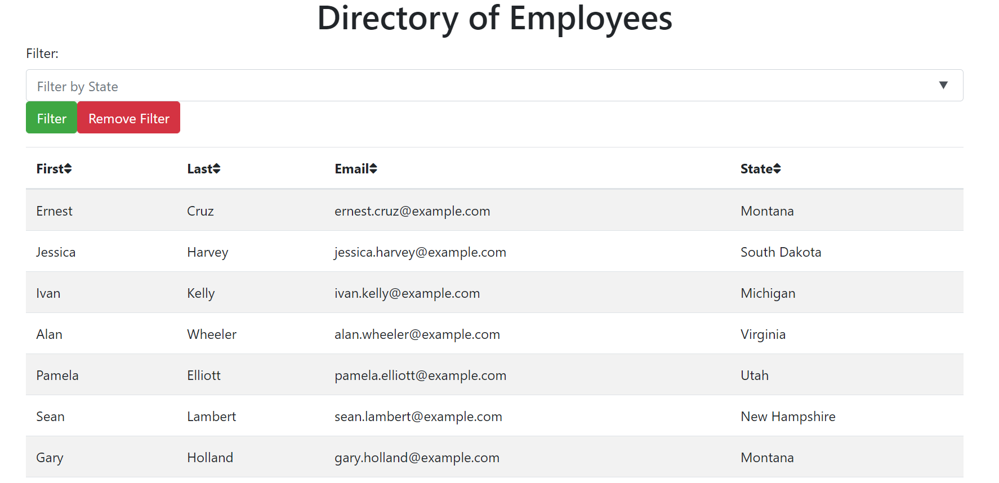

# React-Employee-Directory

#  

### Table of Contents
**[Description](##description)** 
**[Installation Instructions](#installation-instructions)** 
**[Usage Instructions](#usage-instructions)** 
**[License](#license)** 
**[Questions](#questions)** 

## Description
This web application displays an employee directory. The employees are generated from randmuser.me api. Then the results are displayed on the website using React. Users can sort the employee directory and filter by state. The directory is simple, but effective. 

## Installation Instructions
If you want to run this locally, make sure you have node. Clone the repository and run the command npm install. The use npm start to run the application. More information is avalaible in the README.copy.md on this repository.

## Usage Instructions

This application is deployed on github at 

https://26rsuarez.github.io/React-Employee-Directory

Here is a screenshot of the website.

## License

MIT 

Copyright 2020 Raunel Suarez-Magana

Permission is hereby granted, free of charge, to any person obtaining a copy of this software and associated documentation files (the "Software"), to deal in the Software without restriction, including without limitation the rights to use, copy, modify, merge, publish, distribute, sublicense, and/or sell copies of the Software, and to permit persons to whom the Software is furnished to do so, subject to the following conditions:

The above copyright notice and this permission notice shall be included in all copies or substantial portions of the Software.

THE SOFTWARE IS PROVIDED "AS IS", WITHOUT WARRANTY OF ANY KIND, EXPRESS OR IMPLIED, INCLUDING BUT NOT LIMITED TO THE WARRANTIES OF MERCHANTABILITY, FITNESS FOR A PARTICULAR PURPOSE AND NONINFRINGEMENT. IN NO EVENT SHALL THE AUTHORS OR COPYRIGHT HOLDERS BE LIABLE FOR ANY CLAIM, DAMAGES OR OTHER LIABILITY, WHETHER IN AN ACTION OF CONTRACT, TORT OR OTHERWISE, ARISING FROM, OUT OF OR IN CONNECTION WITH THE SOFTWARE OR THE USE OR OTHER DEALINGS IN THE SOFTWARE.

## Questions
Contact me at https://www.github.com/26rsuarez